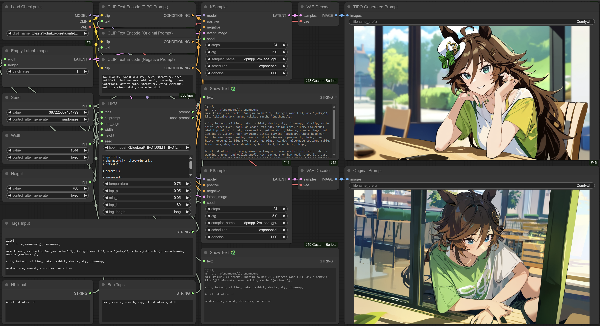

# TIPO-extension [SD-WebUI, ComfyUI, Forge]

A general extension to utilize TIPO or DanTagGen to do "text-presampling" based on KGen library:
https://github.com/KohakuBlueleaf/KGen

It can generate the detail tags/core tags about the character you put in the prompts. It can also add some extra elements into your prompt.

**an extra z is added to repo name to ensure this extension will run `process()` after other extensions**

## What is TIPO

TIPO(Text to Image with text presampling for Prompt Optimization) is a LLM model system designed for generating detailed prompt from input tags or caption. Unlike DTG, TIPO can handle both tags and Natural language. In theory, you can also design your own tag in linguistic way. (For example, long blue hair is acceptable tag in TIPO and will not break the model).

More information can be found in this brief tech report:
https://hackmd.io/@KBlueLeaf/BJULOQBR0

## What is DanTagGen

DanTagGen(Danbooru Tag Generator) is a LLM model designed for generating Danboou Tags with provided informations.
It aims to provide user a more convinient way to make prompts for Text2Image model which is trained on Danbooru datasets.

More information about model arch and training data can be found in the HuggingFace Model card:

[KBlueLeaf/DanTagGen-beta · Hugging Face](https://huggingface.co/KBlueLeaf/DanTagGen-beta)

## How to use it

### SD-WebUI/Forge
Install it from extension tab, after restart the webui, you will found a new nl prompt text box under positive prompt box. And a tipo accordion beside it.

### ComfyUI
Clone this repo into the custom_node folder, after restart the comfyui, you will see TIPO node is under `utils/promptgen` category.

### Options

* tag length:
  * very short: 6~17 tags
  * short: around 18~35 tags
  * long: around 36~53 tags
  * very long: around 54~72 tags
  * ***short or long is recommended***
* NL length:
  * very short: 1~2 sentences
  * short: 2~4 sentences
  * long: 4~6 sentences
  * very long: 6~8 sentences
  * ***short or long is recommended***
* Ban tags: The black list of tags you don't want to see in final prompt. Regex supported.
* Prompt Format: The format of final prompt. Default value is the recommended format of [Kohaku XL Zeta](https://huggingface.co/KBlueLeaf/Kohaku-XL-Zeta)
  * `<|special|>`: 1girl, 1boy, 1other, ...
  * `<|characters|>`: character tags
  * `<|copyrights|>`: copyright tags (series name)
  * `<|artist|>`: artist tags
  * `<|general|>`: general tags
  * `<|meta|>`: highres/lowres/absurdres are all meta tags
  * `<|quality|>`: score_xxx, masterpiece, best quality...
  * `<|rating|>`: safe, sensitive, nsfw, explicit ...
  * `<|generated|>`: generated NL prompt
  * `<|extended|>`: extended NL prompt (If nl prompt is not provided, extended will be filled with generated NL caption. if both extended and generated are in the format but nl prompt is not provided, TIPO will generate 2 NL prompt.)
* Seed: the seed of prompt generator. Since we use temperature/top k/top p sampling, so it is not deterministic unless you use same seed. -1 for random seed.
* Upsampling timing:
  * After: after other prompt processings, for example: after dynamic prompts/wildcard.
  * Before: Before other prompt processings.
* Temperature: Higher = more dynamic result, Lower = better coherence between tags.

## Example

An example workflow for ComfyUI is included in the `examples` folder in this repo, if you want to try it, remember to download https://github.com/pythongosssss/ComfyUI-Custom-Scripts.git into your custom_node folder as well.